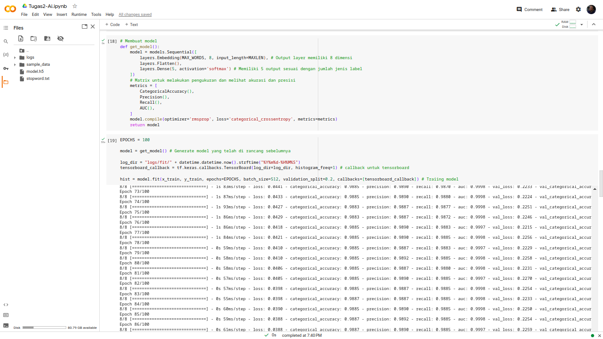
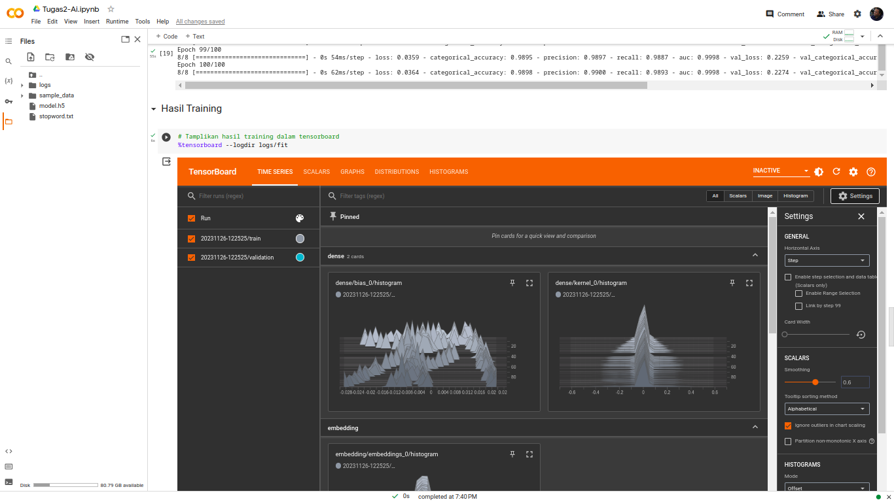
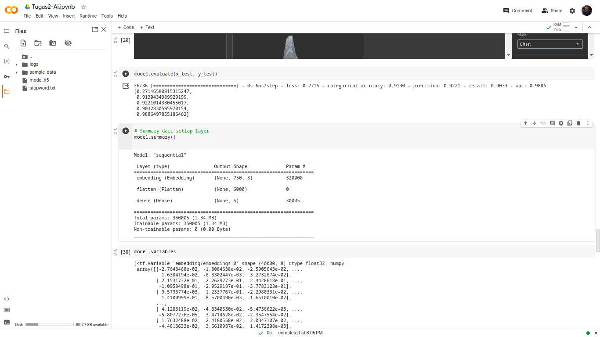

# Tugas-2-Kecerdasan-Artificial-2108107010031

Tugas 2 Kecerdasan Artificial

Nama : Diky Wahyudi<br>
NPM : 2108107010031

## Jenis Kasus
Pada tugas 2 Kecerdasan Artificial ini diangkat sebuah kasus untuk melakukan
klasifikasi terhadap sebuah jenis berita.

## Dataset
Dataset yang digunakan adalah sebuah dataset yang berisikan berita dari sebuah
portal berita di Indonesia dan pada dataset telah memiliki label untuk setiap berita.

Link : [https://huggingface.co/datasets/jakartaresearch/indonews](https://huggingface.co/datasets/jakartaresearch/indonews)

## Data Stopword
Stopword yang digunakan dalam melakukan pre-processing data dapat dilihat dan ditambahkan pada file ```stopword.txt```

## Hasil Model dan Tensorboard
Hasil dari model yang telah di training telah di export menjadi file ```model.h5``` <br>
Hasil log ketika melakukan training untuk tensorboard terdapat pada folder ```logs```

## Proses Training



## Hasil Training


